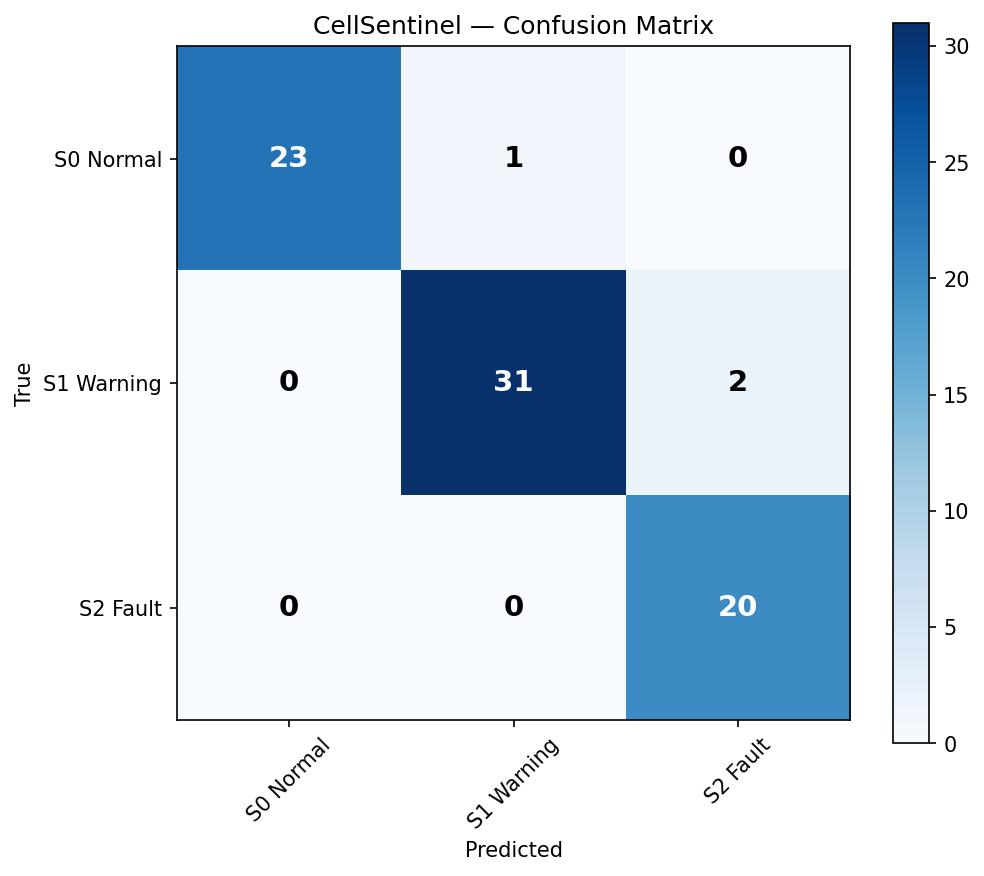
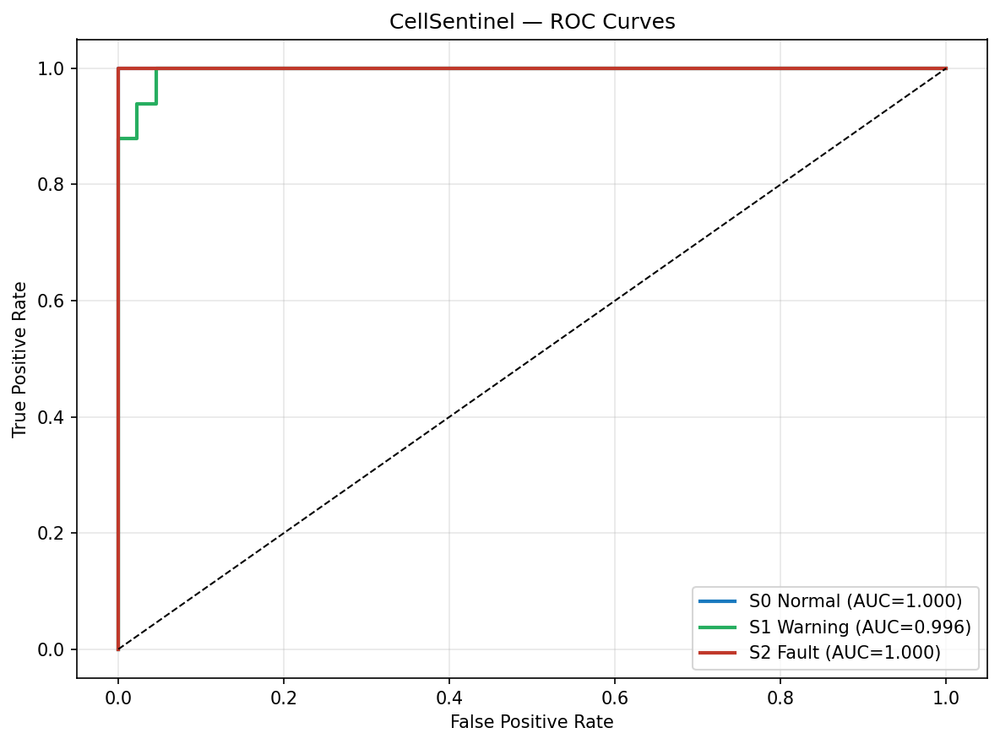
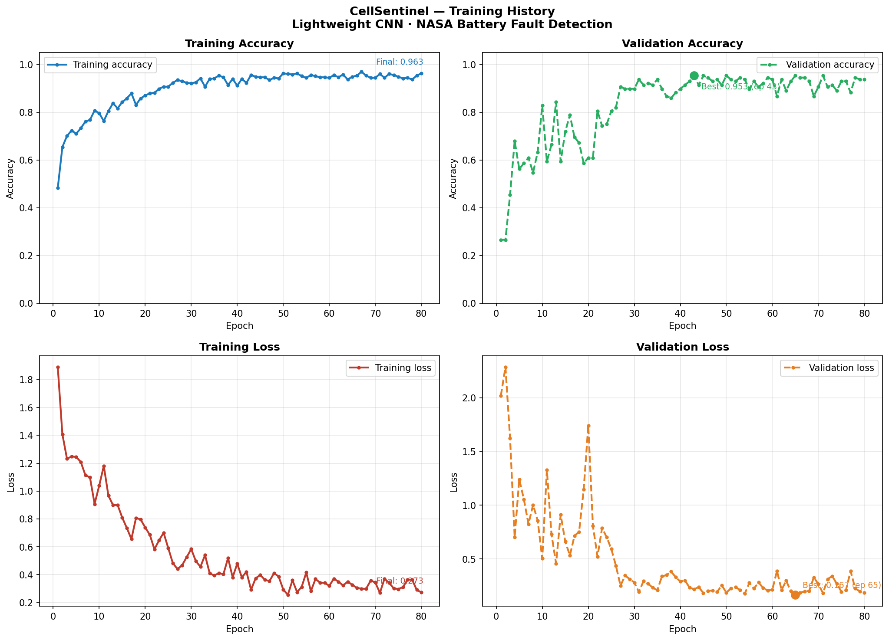

# 🔋 CellSentinel — Li-ion Battery Fault Detection

<p align="center">
  
  
</p>

<p align="center">
  
  
  
  
  
  
</p>

---

## Overview

CellSentinel is an end-to-end deep learning pipeline for early fault detection in Li-ion batteries. It classifies each discharge cycle into one of three health states using a lightweight CNN trained on raw electrochemical signals from the NASA Prognostics Center of Excellence (PCoE) dataset.

| State | Label | Condition |
|---|---|---|
| Normal | S0 | SOH ≥ 90% |
| Warning | S1 | SOH 75–90% or entropy spike |
| Fault | S2 | SOH < 75% or capacity < 1.4 Ah |

---

## Results

| Metric | Score |
|---|---|
| Overall Accuracy | **96%** |
| S0 Normal F1 | **0.98** |
| S1 Warning F1 | **0.95** |
| S2 Fault F1 | **0.95** |
| S2 Fault Recall | **1.00** — zero missed faults |
| S0 Normal AUC | **1.000** |
| S1 Warning AUC | **0.996** |
| S2 Fault AUC | **1.000** |

> All 20 fault cycles correctly detected. All misclassifications are conservative (Warning → Fault), never in the dangerous direction (Fault → Normal).

---

## System Architecture

The pipeline follows a 4-stage Cyber-Physical design:

```
Stage 1 — Extraction
    NASA PCoE .mat files
        → Voltage · Current · Temperature · Capacity time-series

Stage 2 — Information Physics
    Shannon Entropy H(V)    → voltage disorder signal
    Voltage Rebound ΔV      → early degradation indicator
    SOH gradient dQ/dCycle  → capacity fade rate

Stage 3 — Virtual Memory
    MySQL database (cellsentinel)
        → batteries table · cycles table · predictions table

Stage 4 — Inference
    Lightweight CNN
        Input  : (150, 150, 3) discharge curve image
        Output : S0 Normal · S1 Warning · S2 Fault
```

### Signal-to-Image Conversion

Each discharge cycle's raw signals are converted to a `(150, 150, 3)` image:

```
Voltage_measured     [~1054 timesteps] → normalize → interpolate → reshape (150×150) → Channel 0
Current_measured     [~1054 timesteps] → normalize → interpolate → reshape (150×150) → Channel 1
Temperature_measured [~1054 timesteps] → normalize → interpolate → reshape (150×150) → Channel 2
```

---

## Model Architecture

```
Input (150, 150, 3)
    │
    ├── Block 1
    │     Conv2D(32, L2=1e-4) → BN → ReLU
    │     Conv2D(32, L2=1e-4) → BN → ReLU → MaxPool(2) → Dropout(0.2)
    │
    ├── Block 2
    │     Conv2D(64, L2=1e-4) → BN → ReLU
    │     Conv2D(64)           → BN → ReLU → MaxPool(2) → Dropout(0.2)
    │
    ├── Block 3
    │     Conv2D(128, L2=1e-4) → BN → ReLU
    │     Conv2D(128, L2=1e-4) → BN → ReLU → MaxPool(2) → Dropout(0.3)
    │
    ├── Block 4
    │     Conv2D(256, L2=1e-4) → BN → ReLU → GlobalAveragePooling → Dropout(0.4)
    │
    ├── Head
    │     Dense(256, relu) → Dropout(0.3)
    │     Dense(128, relu) → Dropout(0.2)
    │
    └── Dense(3, softmax) → S0 Normal · S1 Warning · S2 Fault

Total parameters : 489,411
Regularization   : L2 (λ=1e-4) on Conv2D layers (except Block 2 layer 2)
Normalization    : BatchNormalization after every Conv2D
```

**Why lightweight CNN over ResNet50:**
- ResNet50 (pretrained on ImageNet) was evaluated first but failed to generalise — ImageNet features do not transfer to battery discharge curves, causing class collapse (train=93%, val=44%)
- ResNet50 has 25M parameters — severely overparameterised for a 636-sample dataset
- The lightweight custom CNN (489K parameters) is right-sized for this dataset and trains from scratch without any pretrained weights
- Training from scratch on domain-specific battery signals outperforms transfer learning here — 96% accuracy vs 48% with ResNet50
- Full training completes in ~8 minutes on an RTX 4060 Laptop GPU

---

## Dataset

**NASA PCoE Li-ion Battery Aging Dataset**  
Saha, B. and Goebel, K. (2007). Battery Data Set. NASA Ames Prognostics Data Repository.

| Battery | Cycles | Initial Capacity | Final SOH |
|---|---|---|---|
| B0005 | 168 | 1.8565 Ah | 71.4% |
| B0006 | 168 | 2.0353 Ah | 58.3% |
| B0007 | 168 | 1.8911 Ah | 75.7% |
| B0018 | 132 | 1.8550 Ah | 72.3% |

**Fault label distribution after tighter thresholds (SOH 75/90%):**

| Label | Count | % |
|---|---|---|
| S0 Normal | 214 | 33.6% |
| S1 Warning | 253 | 39.8% |
| S2 Fault | 169 | 26.6% |

---

## Project Structure

```
CellSentinel/
│
├── data/
│   ├── B0005.mat                    # NASA battery data
│   ├── B0006.mat
│   ├── B0007.mat
│   ├── B0018.mat
│   ├── schema.sql                   # MySQL schema
│   └── populate_battery_data.sql    # Seed data
│
├── src/
│   ├── db.py                        # Shared MySQL connection (WSL + Windows)
│   ├── bridge_mat_to_sql.py         # .mat ingestion + physics feature extraction
│   ├── physics_labeler.py           # Entropy-based fault labeling → MySQL
│   ├── cellsentinel_trainer.py      # CNN training + evaluation
│   ├── app.py                       # Flask API + dashboard server
│   └── setup_database.py            # SQLite alternative setup
│
├── static/
│   └── cellsentinel_dashboard.html  # Interactive Chart.js dashboard
│
├── models/
│   └── best_cellsentinel_v2.h5      # Trained model weights
│
├── results/
│   ├── confusion_matrix.png
│   ├── roc_curve.png
│   └── training_history.png
│
└── requirements.txt
```

---

## Installation

### Prerequisites
- Python 3.10
- NVIDIA GPU (tested on RTX 4060 8GB)
- MySQL 8.0 (or SQLite for local setup)
- TensorFlow 2.10 (Windows GPU) or 2.18 (WSL2)

### Setup

```bash
# Clone repository
git clone https://github.com/shamidou97/CellSentinel.git
cd CellSentinel

# Install dependencies
pip install -r requirements.txt

# Download NASA dataset
# Place B0005.mat, B0006.mat, B0007.mat, B0018.mat in data/

# Setup database (SQLite — no server needed)
python src/setup_database.py

# OR MySQL setup
sudo mysql < data/populate_battery_data.sql
python src/physics_labeler.py
```

---

## Usage

### Train the model

```bash
python src/cellsentinel_trainer.py
```

Expected output:
```
Overall accuracy : 96%
S2 Fault recall  : 1.00
S2 Fault AUC     : 1.000
```

### Run the dashboard

```bash
python src/app.py
```

Open `http://127.0.0.1:5000` — interactive dashboard with:
- SOH fade curves for all 4 batteries
- Cycle-by-cycle fault state timeline
- Shannon entropy and ΔV physics features
- Fault label distribution
- Train/val/test split visualization

---

## Training Configuration

```python
Architecture    : Lightweight CNN (489K params)
Input shape     : (150, 150, 3)
Classes         : 3 (S0 Normal · S1 Warning · S2 Fault)
Optimizer       : Adam (lr=1e-3)
Loss            : sparse_categorical_crossentropy
Regularization  : L2 (lambda=1e-4) on Conv2D layers
Class weights   : {S0: 1.0, S1: 2.0, S2: 6.0}
Batch size      : 16
Max epochs      : 80 (early stopping patience=20)
LR scheduler    : ReduceLROnPlateau (factor=0.5, patience=12)
GPU             : NVIDIA RTX 4060 Laptop 8GB
Training time   : ~8 minutes
```

---

## Training History

<p align="center">
  
</p>

---

## Key Design Decisions

**1. Physics-informed labeling over raw capacity thresholds**  
Fault states incorporate Shannon entropy H(V) spikes to detect early anomalies before capacity visibly degrades — enabling earlier intervention.

**2. Signal-to-image conversion for 2D CNN**  
Reshaping 1D time-series to 2D images allows spatial pattern recognition across the discharge curve shape — the CNN learns to detect fault-characteristic curve deformations.

**3. Conservative error design**  
Class weights (S2=6×) ensure all errors are in the safe direction — Warning predicted as Fault rather than Fault predicted as Normal. Zero dangerous misclassifications in test set.

**4. Cross-dataset generalization**  
B0018 held out completely from training as an independent test battery with different cycle count (132 vs 168) — a realistic generalization test.

---

## Future Work

- [ ] Live inference endpoint — upload `.mat` cycle → real-time fault prediction
- [ ] LSTM / Transformer comparison on same dataset
- [ ] Cross-dataset validation on CALCE and Oxford datasets
- [ ] Remaining Useful Life (RUL) prediction extension
- [ ] Deploy as REST API with Docker

---

## Citation

```bibtex
@dataset{nasa_battery_2007,
  author    = {Saha, Bhaskar and Goebel, Kai},
  title     = {Battery Data Set},
  year      = {2007},
  publisher = {NASA Ames Prognostics Data Repository},
  url       = {https://ti.arc.nasa.gov/tech/dash/groups/pcoe/prognostic-data-repository/}
}
```

---

## License

MIT License — see [LICENSE](LICENSE) for details.

---

<p align="center">
  Built with TensorFlow · NASA PCoE Data · RTX 4060 GPU
</p>
